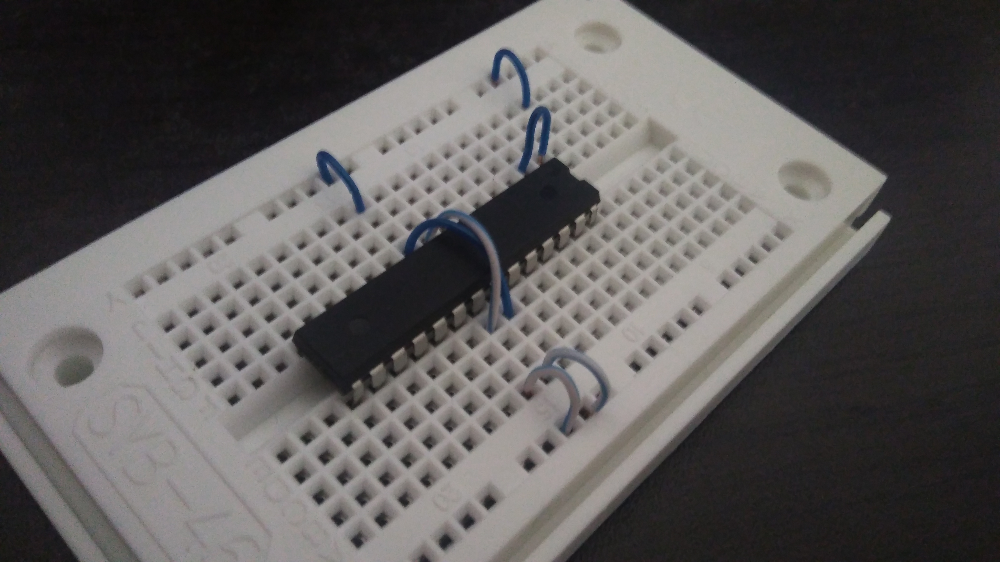
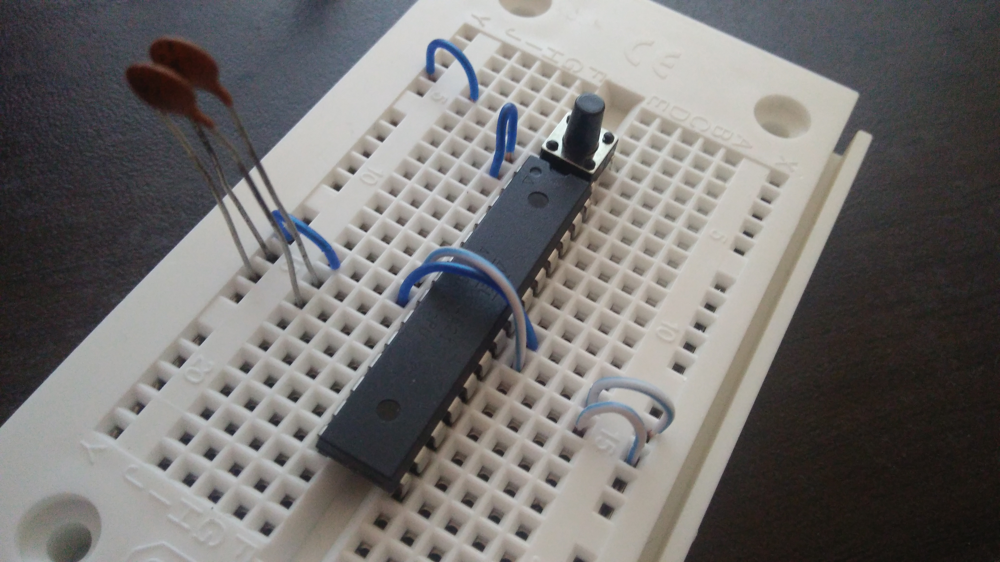
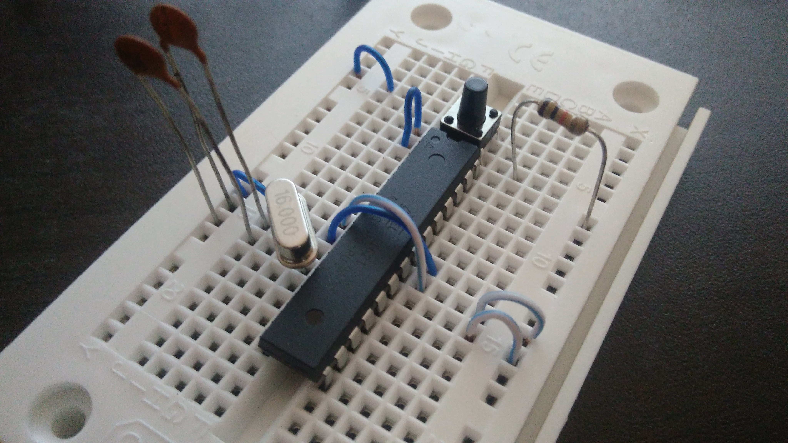
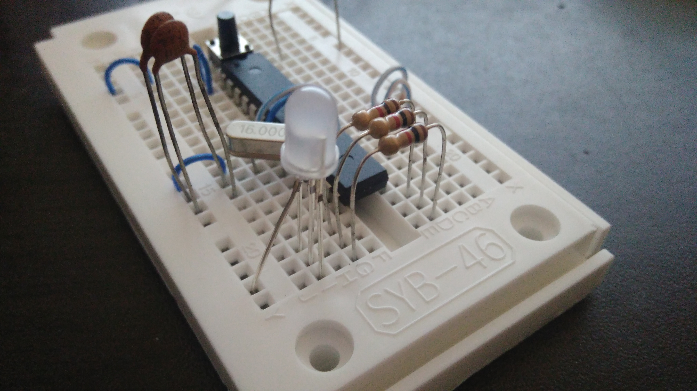

# Arduino 101
Taller realizado para introducir un poco el funcionamiento de la tarjeta Arduino con leds RGB's y señales digitales. Adicionalmente se introduce el tema de la comunicacion serial para trabajar con scripts locales en python o en node.js.

## Arduino on Board
El ideal es montar primero la tarjeta en la protoboard, por lo cual se recomienda seguir los pasos visuales que se muestran a continuacion:

* Arduino en la protoboard

* Arduino en la protoboard

* Arduino en la protoboard

* Arduino en la protoboard

## Driver for CP210x
Es necesario tener instalado este driver en nuestra maquina ya que el chipset es diferente a los que se reconocen automaticamente en el computador.

http://www.silabs.com/products/mcu/pages/usbtouartbridgevcpdrivers.aspx

## RGB Led Strip Library
Si se alcanza a trabajar por completo con el RGB Strip, es necesario instalar la libreria disponible en sparkfun.
https://cdn.sparkfun.com/assets/0/4/a/f/8/51f1806cce395fcd20000004.zip
