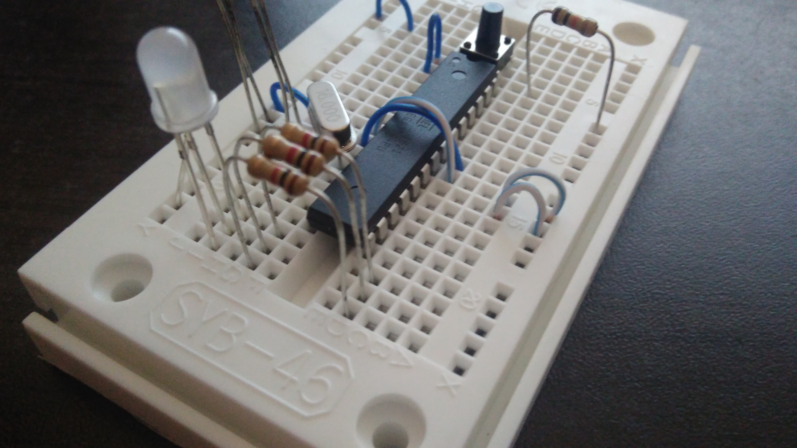
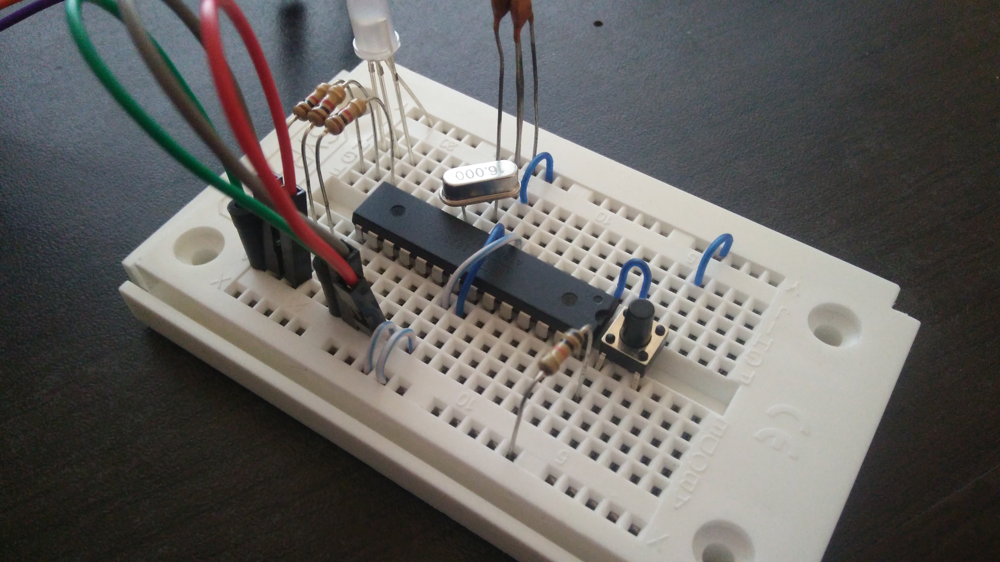
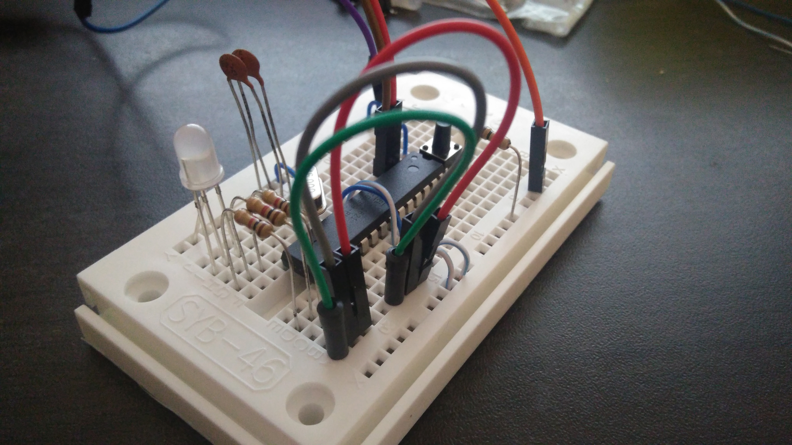
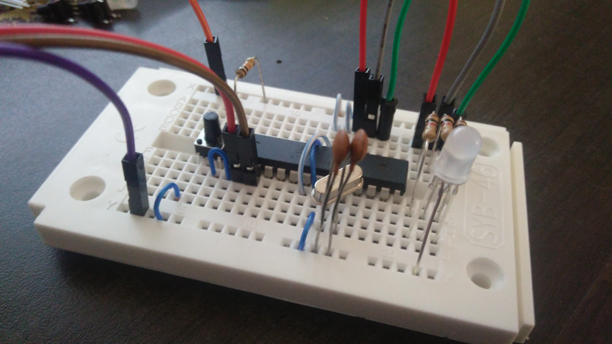

# Arduino 101
Taller realizado para introducir un poco el funcionamiento de la tarjeta Arduino con leds RGB's y señales digitales. Adicionalmente se introduce el tema de la comunicacion serial para trabajar con scripts locales en python o en node.js.

El siguiente diagrama puede ser muy util durante el taller:

## Arduino on Board
Estos son los materiales que tendran a disposicion:
* Led RGB
* 3 Resistencias de 1 K Ohm (cafe-negro-rojo)
* Resistencia de 10 K Ohm (cafe-negro-naranja)
* Pulsador
* 1 Cristal
* 2 Capacitors de 22 pF
* Micro ATMega328p
* ProtoBoard
* 3 cables M-M
* 4 cables H-H (Juntos)
* 4 cables M-M (separados)

El ideal es montar primero la tarjeta en la protoboard, por lo cual se recomienda seguir los pasos visuales que se muestran a continuacion:

* Ubicar el ATMega328p la protoboard con conexiones iniciales

* Agregar los capacitores y el Pulsador

* Ubicar la resistencia de 10K Ohm y el Cristal

* Agreagar el Led con las resistencias de 1K Ohm

* Hacer puente de las resistencias con los leds al micro.

* Perspectiva 1 para conectar el comunicador serial

* Perspectiva 2 para conectar el comunicador serial

## Driver for CP210x
Es necesario tener instalado este driver en nuestra maquina ya que el chipset es diferente a los que se reconocen automaticamente en el computador.

http://www.silabs.com/products/mcu/pages/usbtouartbridgevcpdrivers.aspx

## RGB Led Strip Library
Si se alcanza a trabajar por completo con el RGB Strip, es necesario instalar la libreria disponible en sparkfun.
https://cdn.sparkfun.com/assets/0/4/a/f/8/51f1806cce395fcd20000004.zip y consultar el siguiente codigo https://github.com/jjcc1421/WebLedStrip/blob/master/ArduinoCode/ArduinoCode.ino
